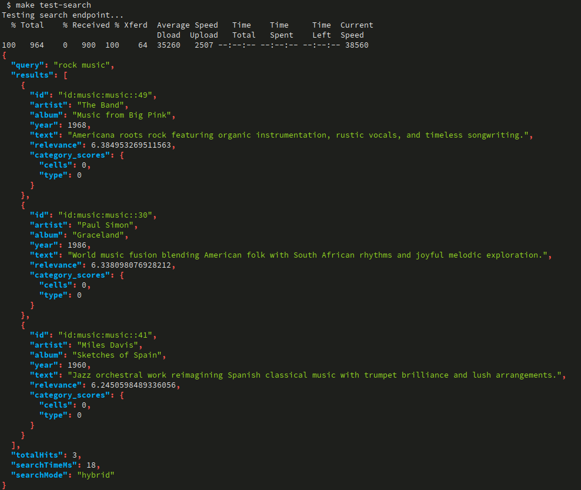
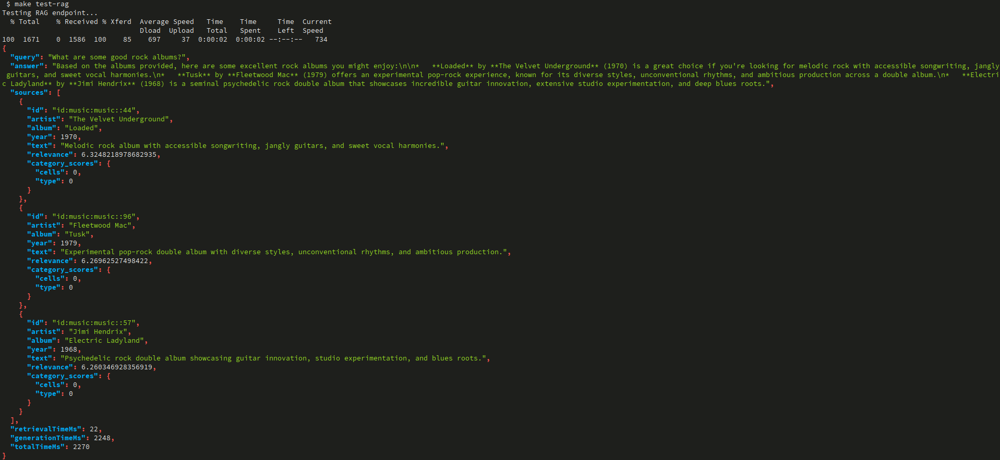

# Vespa RAG Demo

This project demonstrates a Retrieval-Augmented Generation (RAG) application using Vespa as the search engine and a Spring Boot backend to orchestrate the process. The application allows searching for music albums and uses a Large Language Model (LLM) to generate descriptions or answer questions based on the search results.

## Overview

The architecture consists of two main components:
- **Vespa**: A powerful search engine that indexes music album data and provides fast and relevant search results.
- **RAG Application**: A Spring Boot application that provides a REST API for search and RAG queries. It queries Vespa to retrieve relevant documents and then uses the results to prompt a generative AI model.

This demo is containerized and managed using Docker Compose and a `Makefile` for easy setup and execution.

## Requirements

- Docker and Docker Compose
- `make`
- A Gemini API Key

## Quick Start

1.  **Create a `.env` file:**
    Copy the `.env.example` file to `.env` and add your Gemini API key:
    ```bash
    cp .env.example .env
    ```
    Then, edit `.env` and add your key:
    ```
    GEMINI_API_KEY=your_gemini_api_key_here
    ```

2.  **Run the Quickstart command:**
    This command will build the Docker images, start the services, deploy the Vespa application, and feed the sample data.
    ```bash
    make quickstart
    ```

3.  **Test the application:**
    Once the quickstart is complete, you can test the search and RAG endpoints.

    *   **Test the search endpoint:**
        ```bash
        make test-search
        ```
        This will query the search API for "rock music".

    *   **Test the RAG endpoint:**
        ```bash
        make test-rag
        ```
        This will send a question to the RAG API and return a generated answer.

## Available `make` Commands

This project uses a `Makefile` to simplify common tasks.

### Docker Compose Commands
- `make build`: Build the Docker images.
- `make up`: Start all services in the background.
- `make down`: Stop all services.
- `make restart`: Restart all services.
- `make logs`: View logs from all services.
- `make logs-vespa`: View logs from the Vespa container.
- `make logs-app`: View logs from the RAG application container.
- `make clean`: Stop all services and remove Docker volumes.

### Vespa Commands
- `make deploy`: Deploy the Vespa application schema.
- `make feed`: Feed the sample data to Vespa.
- `make vespa-status`: Check the status of the Vespa instance.
- `make vespa-health`: Check the health of the Vespa instance.

### Testing Commands
- `make health`: Check the health of all services.
- `make test-search`: Run a sample query against the search endpoint.
- `make test-rag`: Run a sample query against the RAG endpoint.

### Development Commands
- `make rebuild-app`: Rebuild and restart the RAG application service.
- `make shell-vespa`: Open a shell inside the Vespa container.
- `make shell-app`: Open a shell inside the RAG application container.

## Project Structure

```
vespa-demo/
├── app/                    # Vespa application configuration
│   ├── schemas/
│   │   └── music.sd        # Vespa document schema
│   └── services.xml
├── build.gradle            # Gradle build file for the Java application
├── dataset/
│   └── documents.jsonl     # Sample data
├── docker-compose.yml      # Docker Compose file for services
├── Dockerfile              # Dockerfile for the Spring Boot application
├── Makefile                # Makefile with helper commands
├── src/                    # Java source code for the RAG application
└── ...
```

## API Endpoints

The RAG application exposes the following endpoints on `http://localhost:8081`:

- `POST /api/search`: Searches the Vespa index.
- `POST /api/rag/query`: Performs a RAG query.
- `GET /api/search/health`: Health check for the search service.
- `GET /api/rag/health`: Health check for the RAG service.

The Vespa instance is available on `http://localhost:8080`.

## Testing output

- Test the search endpoint


- Test the RAG endpoint

